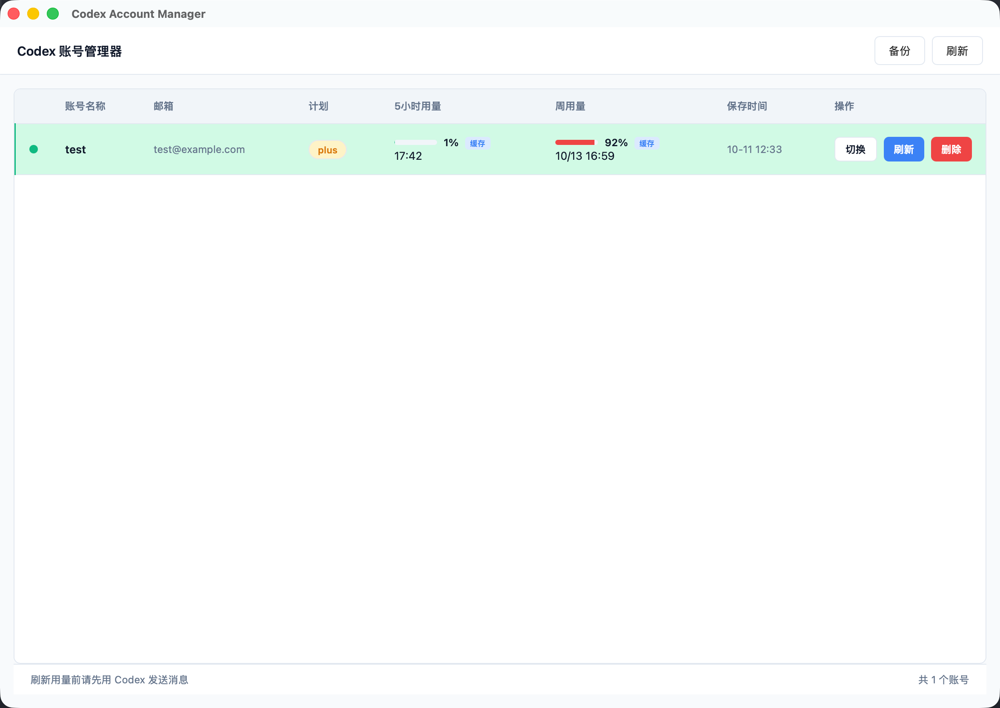

# OpenAI Codex 账号管理器


一个用于管理和切换多个 OpenAI 账号配置的工具集，支持账号备份、快速切换、用量监控等功能。

## 📸 应用预览



## 📁 项目结构

```
codex-account-manager/
├── README.md                    # 使用说明
├── codex_account_manager.py     # 完整的账号管理器（交互式界面）
├── codex_account_manager_web.py # Web GUI界面管理器（推荐）
├── switch_account.py            # 快速切换账号脚本
├── backup_current_account.py    # 备份当前账号配置脚本（智能提取邮箱）
├── usage_checker.py             # 用量查询模块
├── check_usage.py               # 独立的用量查询工具
├── codex-tauri-app/            # Tauri 桌面应用（跨平台）
│   ├── src/                    # 前端源码
│   ├── src-tauri/              # Rust 后端
│   └── README.md               # Tauri 应用说明
└── codex-config/               # 账号配置存储目录
    ├── auth.json               # 当前活跃账号配置
    ├── auth.json.backup        # 自动备份文件
    └── accounts/               # 所有保存的账号配置
        ├── work_account.json
        ├── personal_account.json
        └── current_backup.json
```

## 🚀 快速开始

### 环境要求
- Python 3.6 或更高版本（Python 脚本方式）
- 或者使用 Tauri 桌面应用（无需 Python）
- 已安装 Claude Code（Codex CLI）

### 安装使用

#### 方式一：使用 Tauri 桌面应用（推荐）

**下载安装包**
```bash
# 从 Releases 页面下载对应平台的安装包
# macOS: .dmg 或 .app
# Windows: .msi 或 .exe
# Linux: .deb 或 .AppImage
```

**macOS 用户注意 ⚠️**

由于应用未经过苹果官方签名，首次运行可能会提示「应用已损坏」。解决方法：

1. 打开终端（Terminal）
2. 输入 `xattr -cr ` （注意 cr 后面有个空格）
3. 把应用图标拖拽到终端窗口
4. 按回车执行

**或从源码构建**

前置要求：需要安装 Node.js 和 Rust，详见 [codex-tauri-app/README.md](codex-tauri-app/README.md)

```bash
cd codex-tauri-app
npm install
npm run tauri build
```

**功能特性**
- ✅ 图形化界面操作
- ✅ 支持所有账号管理功能
- ✅ 跨平台支持（macOS、Windows、Linux）
- ✅ 30天用量缓存
- ✅ 无需 Python 环境

#### 方式二：使用 Python 脚本

**1. 克隆项目**
```bash
git clone https://github.com/your-username/codex-account-manager.git
cd codex-account-manager
```

**2. 使用Web GUI界面**
```bash
# 启动Web界面管理器
python3 codex_account_manager_web.py
```
浏览器会自动打开 http://localhost:8888，您可以通过可视化界面管理账号。

**3. 备份当前账号**
```bash
# 自动备份当前账号（智能提取邮箱作为名称）
python3 backup_current_account.py

# 或者指定账号名称
python3 backup_current_account.py work_account
```

**4. 查看可用账号**
```bash
python3 switch_account.py
```

**5. 切换账号**
```bash
python3 switch_account.py work_account
```

**6. 使用完整管理界面（命令行）**
```bash
python3 codex_account_manager.py
```

**7. 查看账号用量**
```bash
# 查看当前账号用量
python3 check_usage.py

# 查看指定账号用量
python3 check_usage.py -a work_account

# 查看所有账号用量
python3 check_usage.py --all

# 显示详细用量信息
python3 check_usage.py -d
```

## 📋 功能特性

### ✨ 智能模式检测
- **项目模式**: 在项目目录中运行时，配置存储在项目内
- **系统模式**: 在其他位置运行时，使用系统默认配置
- **自动同步**: 项目配置与系统配置自动同步

### 🔄 账号管理功能
1. **保存当前账号配置** - 备份当前登录的账号
2. **从配置内容添加账号** - 直接粘贴 auth.json 内容添加账号
3. **列出所有账号** - 查看所有保存的账号及其信息
4. **切换账号** - 快速切换到指定账号
5. **删除账号配置** - 删除不需要的账号配置
6. **显示当前账号** - 查看当前活跃账号信息
7. **账号用量查询** - 查看账号使用情况、剩余额度和费用统计
8. **配置同步** - 在项目配置和系统配置间同步

## 📖 详细使用说明

### 添加新账号

#### 方法1: 从当前登录状态保存
1. 在浏览器中登录目标账号
2. 等待 Claude Code 更新配置
3. 运行备份脚本:
   ```bash
   python3 backup_current_account.py my_new_account
   ```

#### 方法2: 直接粘贴配置
1. 运行管理器: `python3 codex_account_manager.py`
2. 选择 "2. 从配置内容添加账号"
3. 输入账号名称
4. 粘贴完整的 auth.json 内容
5. 按 Ctrl+D (Mac/Linux) 或 Ctrl+Z (Windows) 完成输入

### 切换账号
```bash
# 快速切换
python3 switch_account.py account_name

# 或使用交互界面
python3 codex_account_manager.py
```

### 管理多个账号
```bash
# 列出所有账号
python3 switch_account.py

# 查看当前账号信息
python3 codex_account_manager.py  # 选择选项 6

# 查看账号用量统计
python3 check_usage.py --all
```

### 用量监控
```bash
# 快速查看当前账号用量（实时）
python3 check_usage.py

# 查看详细用量报告（实时）
python3 check_usage.py -d

# 查看指定账号用量（缓存数据）
python3 check_usage.py -a account_name -d

# 查看所有账号用量（缓存数据）
python3 check_usage.py --all
```

⚠️ **用量查询说明**：
- **当前账号**：可以实时查询最新用量数据
- **其他账号**：只能查看缓存的用量数据
- **缓存机制**：切换账号时会自动保存当前账号的用量数据
- **缓存有效期**：24小时，过期后需要切换到该账号重新查询

## ⚠️ 重要说明

### 令牌过期处理
- **access_token**: 短期有效（几小时到1天），会自动刷新
- **refresh_token**: 长期有效（几周到几个月）
- 如果长时间不使用某个账号，可能需要重新登录更新配置

### 用量限制说明
- **Codex 使用限制**: 基于任务数量，通常每5小时重置
- **Plus 账号**: 约30-150个任务/5小时，有周限制
- **Pro 账号**: 约300-1500个任务/5小时，限制更宽松
- **费用跟踪**: 支持查看7天费用和当月总费用

### 安全建议
- 配置文件包含敏感信息，请妥善保管
- 不要将 `accounts/` 目录提交到公共代码仓库
- 建议定期更新账号配置以保持有效性

### 故障排除
- 如果切换后提示认证失败，请重新登录该账号
- 如果配置文件损坏，请从备份恢复或重新添加账号
- 项目模式和系统模式的配置是独立的，可以通过同步功能保持一致

## 🔧 高级用法

### 批量操作
```bash
# 备份多个账号
python3 backup_current_account.py work_account
# 切换到另一个账号...
python3 backup_current_account.py personal_account
```

### 配置文件直接编辑
配置文件存储在 `codex-config/accounts/` 目录中，可以直接编辑 JSON 文件。

### 自定义脚本
可以基于现有脚本创建自定义的账号管理脚本，例如自动切换、定时备份等。

## 📞 支持

如有问题或建议，请：
1. 提交 [GitHub Issue](https://github.com/your-username/codex-account-manager/issues)
2. 查看下方故障排除指南
3. 参与 [Discussions](https://github.com/your-username/codex-account-manager/discussions)

### 常见问题排查
- 配置文件路径是否正确
- 权限设置是否允许读写
- JSON 格式是否正确
- 系统 Python 环境是否正常

## 🤝 贡献

欢迎提交 Issue 和 Pull Request 来改进项目！请查看 [CONTRIBUTING.md](CONTRIBUTING.md) 了解详细贡献指南。

### 开发环境设置
```bash
# 克隆项目
git clone https://github.com/your-username/codex-account-manager.git
cd codex-account-manager

# 安装开发依赖（如需要）
pip install -r requirements.txt
```

## 📄 许可证

本项目采用 MIT 许可证 - 查看 [LICENSE](LICENSE) 文件了解详细信息。

## ⚠️ 免责声明

本项目仅供学习和个人使用。请确保遵守 OpenAI 的服务条款和相关法律法规。作者不对使用本工具产生的任何问题承担责任。